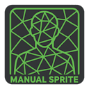
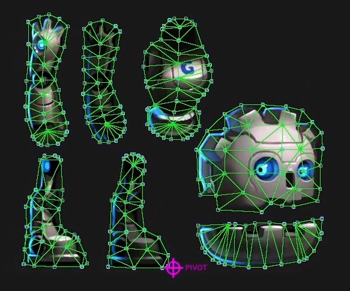
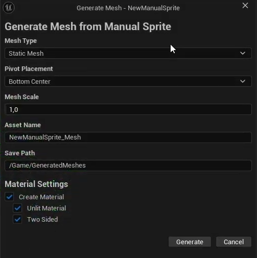

## EN

# Manual Sprite Editor Tools for Unreal Engine

**Manual Sprite Editor Tools** is a comprehensive plugin for Unreal Engine that provides a dedicated editor for creating and managing custom 2D geometry for `PaperSprite` assets. It is an indispensable tool for developers who need precise control over their sprite meshes, especially for generating optimized `StaticMesh` and `SkeletalMesh` assets from 2D art.

This plugin was created to fill a critical gap in the standard Paper2D workflow, offering features essential for advanced 2D game development.

*Click the image to watch a full demonstration of the geometry editing and mesh generation process.*

---

## Table of Contents

- [About The Project](#about-the-project)
- [Key Features](#key-features)
- [Installation](#installation)
- [How to Use](#how-to-use)
  - [Step 1: Create a Manual Sprite Asset](#step-1-create-a-manual-sprite-asset)
  - [Step 2: Open the Editor](#step-2-open-the-editor)
  - [Step 3: Edit the Geometry](#step-3-edit-the-geometry)
  - [Step 4: Generate a Mesh](#step-4-generate-a-mesh)
- [Editor Interface](#editor-interface)
  - [Toolbar](#toolbar)
  - [Hotkeys](#hotkeys)
- [Project Settings](#project-settings)
- [Contact](#contact)

## About The Project

The standard Unreal Engine workflow for 2D sprites is excellent for simple cases but lacks the precision and flexibility needed for complex characters or objects. This plugin introduces a new asset, `Manual Sprite`, and a dedicated editor to give developers full control over its geometry, enabling:
-   The creation of **pixel-perfect collision shapes.**
-   **Optimized mesh complexity** by manually placing vertices and triangles.
-   The ability to **generate 3D meshes (`StaticMesh` and `SkeletalMesh`)** directly from 2D geometry, complete with materials and a basic skeleton.

## Key Features

-   ✅ **Dedicated Asset Editor:** A professional, standalone editor for `Manual Sprite` assets with a viewport, details panel, and a feature-rich toolbar.
-   ✅ **Full Geometry Control:** Manually add, delete, and move vertices. Create triangles by selecting any three vertices.
-   ✅ **Advanced Editing Tools:**
    -   **Full Undo/Redo support** for all geometry operations.
    -   **Copy, Paste, Cut, and Duplicate** functionality for vertices.
    -   **Mirror Editing** on the X, Y, or both axes to speed up symmetrical work.
    -   **Grid and Snapping** for precise vertex placement.
-   ✅ **Mesh Generation:**
    -   Generate **`StaticMesh`** or **`SkeletalMesh`** assets with a single click (`Ctrl+M`).
    -   Full control over **Pivot Point placement** (Center, Bottom, Origin, or Custom).
    -   Automatic material creation (Lit/Unlit, Two-Sided).
-   ✅ **Intelligent Triangulation:**
    -   **Automatic Delaunay triangulation** for selected vertices (hotkey `3`).
    -   **Intersection validation**, which highlights overlapping edges in red to ensure clean geometry.
-   ✅ **Seamless Editor Integration:** Create `Manual Sprite` assets directly from the Content Browser.

## Installation

1.  Copy the `ManualSpriteEditorTools` folder into your project's `Plugins` directory. (If a `Plugins` folder doesn't exist, create one in the project's root folder).
2.  Restart the Unreal Engine editor.
3.  The engine will prompt you to compile the plugin if necessary. Agree and wait for it to finish.
4.  The plugin is now ready to use!

## How to Use

### Step 1: Create a Manual Sprite Asset

In the **Content Browser**, right-click, navigate to the **Paper2D** category, and select **Manual Sprite**. Name your new asset.

### Step 2: Open the Editor

Double-click your new `Manual Sprite` asset to open the dedicated editor. In the **Details** panel, assign a **Source Texture** and ensure the **Use Manual Geometry** checkbox is enabled.

### Step 3: Edit the Geometry

Use the toolbar buttons or hotkeys to shape your mesh.

-   **Select Mode (Q):** Click and drag to move vertices. Drag in an empty area to create a selection box.
-   **Add Vertex Mode (W):** Click anywhere in the viewport to add a new vertex.
-   **Triangle Mode (E):** Select any three vertices to create a triangle. The selection will clear automatically.
-   **Delete Mode (R):** Click on a vertex or triangle to remove it.

### Step 4: Generate a Mesh

Once your geometry is complete, press `Ctrl+M` or click the **Generate** button on the toolbar. This will open the **Mesh Generation** dialog.

Here you can configure the output:
-   **Mesh Type:** Choose between `StaticMesh` and `SkeletalMesh`.
-   **Pivot Placement:** Define the object's origin point.
-   **Asset Name & Path:** Set the name and location for the new assets.
-   **Material Settings:** Automatically create a Lit or Unlit material for the mesh.

Click **Generate**, and the new assets will be created and highlighted in the Content Browser!

## Editor Interface

### Toolbar

The toolbar provides quick access to all major functions:

| Group         | Buttons                                       | Description                                      |
| :------------ | :-------------------------------------------- | :----------------------------------------------- |
| **History**   | Undo, Redo                                    | Standard undo/redo functionality.                |
| **Modes**     | Select, Add, Triangle, Delete                 | Switch between geometry editing modes.           |
| **Mirroring** | X, Y, XY                                      | Toggle mirror editing on different axes.         |
| **Grid**      | Grid, Snap, Size                              | Control the grid's visibility, snapping, and size. |
| **Tools**     | (Dropdown Menu)                               | Access copy/paste, selection, and utility tools. |
| **Generate**  | Generate                                      | Opens the Mesh Generation dialog.                |

### Hotkeys

| Key               | Action                                                      |
| :---------------- | :---------------------------------------------------------- |
| **Q, W, E, R**    | Switch Edit Mode                                            |
| **X, Y, Shift+X** | Toggle Mirroring                                            |
| **G, Ctrl+G**     | Toggle Grid / Snapping                                      |
| **3**             | Auto-triangulate selected vertices                          |
| **4**             | Delete all triangles connected to selected vertices         |
| **V**             | Validate triangulation for intersections                    |
| **Ctrl+Z / Ctrl+Y** | Undo / Redo                                                 |
| **Ctrl+C / Ctrl+V** | Copy / Paste vertices                                       |
| **Ctrl+M**        | Open Mesh Generation dialog                                 |
| **Delete**        | Delete selected vertices/triangles                          |
| **Mouse Wheel**   | Zoom In / Out                                               |
| **Middle Mouse**  | Pan the view                                                |

## Project Settings

You can configure default mesh generation settings in **Edit -> Project Settings -> Plugins -> Manual Sprite Mesh Generator**.

## Contact

Project Link: [https://boosty.to/channel-jonathan-developer](https://boosty.to/channel-jonathan-developer)

## RU

# Manual Sprite Editor Tools для Unreal Engine

**Manual Sprite Editor Tools** — это комплексный плагин для Unreal Engine, предоставляющий специализированный редактор для создания и управления пользовательской 2D-геометрией для ассетов `PaperSprite`. Это незаменимый инструмент для разработчиков, которым нужен точный контроль над мешами спрайтов, особенно для генерации оптимизированных ассетов `StaticMesh` и `SkeletalMesh` из 2D-графики.

Этот плагин был создан, чтобы заполнить критический пробел в стандартном рабочем процессе Paper2D, предлагая функции, необходимые для продвинутой разработки 2D-игр.

*Нажмите на изображение, чтобы посмотреть полную демонстрацию процесса редактирования геометрии и генерации меша.*

---

## Оглавление

- [О проекте](#о-проекте)
- [Ключевые возможности](#ключевые-возможности)
- [Установка](#установка)
- [Как использовать](#как-использовать)
  - [Шаг 1: Создайте ассет Manual Sprite](#шаг-1-создайте-ассет-manual-sprite)
  - [Шаг 2: Откройте редактор](#шаг-2-откройте-редактор)
  - [Шаг 3: Отредактируйте геометрию](#шаг-3-отредактируйте-геометрию)
  - [Шаг 4: Сгенерируйте меш](#шаг-4-сгенерируйте-меш)
- [Интерфейс редактора](#интерфейс-редактора)
  - [Тулбар (Панель инструментов)](#тулбар-панель-инструментов)
  - [Горячие клавиши](#горячие-клавиши)
- [Настройки проекта](#настройки-проекта)
- [Контакты](#контакты)

## О проекте

Стандартный рабочий процесс Unreal Engine для 2D-спрайтов хорош для простых случаев, но ему не хватает точности и гибкости, необходимых для сложных персонажей или объектов. Этот плагин представляет новый ассет, `Manual Sprite`, и специальный редактор, чтобы дать разработчикам полный контроль над геометрией, позволяя:
-   Создавать **идеальные попиксельные коллизии.**
-   **Оптимизировать сложность меша**, вручную расставляя вершины и треугольники.
-   **Генерировать 3D-меши (`StaticMesh` и `SkeletalMesh`)** прямо из 2D-геометрии, в комплекте с материалами и базовым скелетом.

## Ключевые возможности

-   ✅ **Специализированный редактор ассетов:** Профессиональный, отдельный редактор для ассетов `Manual Sprite` с вьюпортом, панелью деталей и многофункциональным тулбаром.
-   ✅ **Полный контроль над геометрией:** Вручную добавляйте, удаляйте и перемещайте вершины. Создавайте треугольники, выбирая любые три вершины.
-   ✅ **Продвинутые инструменты редактирования:**
    -   **Полная поддержка Undo/Redo** для всех операций с геометрией.
    -   Функции **Копировать, Вставить, Вырезать и Дублировать** для вершин.
    -   **Зеркальное редактирование** по осям X, Y или обеим сразу для ускорения работы с симметричными объектами.
    -   **Сетка и привязка к сетке** для точного размещения вершин.
-   ✅ **Генерация мешей:**
    -   Генерируйте ассеты **`StaticMesh`** или **`SkeletalMesh`** в один клик (`Ctrl+M`).
    -   Полный контроль над **расположением пивота (Pivot Point)** (Центр, Низ, Начало координат или Пользовательский).
    -   Автоматическое создание материалов (Lit/Unlit, двусторонние).
-   ✅ **Интеллектуальная триангуляция:**
    -   **Автоматическая триангуляция Делоне** для выделенных вершин (клавиша `3`).
    -   **Проверка на пересечения**, которая подсвечивает пересекающиеся ребра красным, обеспечивая чистую геометрию.
-   ✅ **Полная интеграция с редактором:** Создавайте ассеты `Manual Sprite` прямо из Content Browser.

## Установка

1.  Скопируйте папку `ManualSpriteEditorTools` в директорию `Plugins` вашего проекта. (Если папки `Plugins` нет, создайте ее в корневой папке проекта).
2.  Перезапустите редактор Unreal Engine.
3.  Движок предложит скомпилировать плагин, если это необходимо. Согласитесь и дождитесь завершения.
4.  Плагин готов к использованию!

## Как использовать

### Шаг 1: Создайте ассет Manual Sprite

В **Content Browser** нажмите правую кнопку мыши и в категории **Paper2D** выберите **Manual Sprite**. Дайте имя вашему новому ассету.

### Шаг 2: Откройте редактор

Дважды щелкните по вашему новому ассету `Manual Sprite`, чтобы открыть специализированный редактор. В панели **Details** назначьте **Source Texture** и убедитесь, что галочка **Use Manual Geometry** включена.

### Шаг 3: Отредактируйте геометрию

Используйте кнопки на тулбаре или горячие клавиши для формирования вашего меша.

-   **Режим выделения (Q):** Нажмите и перетаскивайте, чтобы перемещать вершины. Перетаскивайте на пустом месте, чтобы создать рамку выделения.
-   **Режим добавления вершин (W):** Нажмите в любом месте вьюпорта, чтобы добавить новую вершину.
-   **Режим треугольников (E):** Выберите любые три вершины, чтобы создать треугольник. Выделение очистится автоматически.
-   **Режим удаления (R):** Нажмите на вершину или треугольник, чтобы удалить его.

### Шаг 4: Сгенерируйте меш

Когда ваша геометрия будет готова, нажмите `Ctrl+M` или кнопку **Generate** на тулбаре. Откроется диалоговое окно **Mesh Generation**.

Здесь вы можете настроить результат:
-   **Mesh Type:** Выберите между `StaticMesh` и `SkeletalMesh`.
-   **Pivot Placement:** Определите, где будет находиться точка опоры (пивот) объекта.
-   **Asset Name & Path:** Укажите имя и местоположение для новых ассетов.
-   **Material Settings:** Автоматически создайте Lit или Unlit материал для меша.

Нажмите **Generate**, и новые ассеты будут созданы и подсвечены в Content Browser!

## Интерфейс редактора

### Тулбар (Панель инструментов)

Тулбар предоставляет быстрый доступ ко всем основным функциям:

| Группа                 | Кнопки                                        | Описание                                          |
| :--------------------- | :-------------------------------------------- | :------------------------------------------------ |
| **История**            | Undo, Redo                                    | Стандартные функции отмены/повтора действий.      |
| **Режимы**             | Select, Add, Triangle, Delete                 | Переключение между режимами редактирования.       |
| **Зеркалирование**     | X, Y, XY                                      | Включение зеркального редактирования по осям.     |
| **Сетка**              | Grid, Snap, Size                              | Управление видимостью, привязкой и размером сетки.|
| **Инструменты**        | (Выпадающее меню)                             | Доступ к копированию, выделению и утилитам.       |
| **Генерация**          | Generate                                      | Открывает диалог генерации меша.                  |

### Горячие клавиши

| Клавиша          | Действие                                                       |
| :--------------- | :------------------------------------------------------------- |
| **Q, W, E, R**   | Переключить режим редактирования                               |
| **X, Y, Shift+X**| Включить зеркалирование                                        |
| **G, Ctrl+G**    | Включить сетку / привязку к сетке                              |
| **3**            | Авто-триангуляция выделенных вершин                            |
| **4**            | Удалить все треугольники, связанные с выделенными вершинами    |
| **V**            | Проверить триангуляцию на пересечения                          |
| **Ctrl+Z / Ctrl+Y** | Отменить / Повторить действие                                 |
| **Ctrl+C / Ctrl+V** | Копировать / Вставить вершины                                 |
| **Ctrl+M**       | Открыть диалог генерации меша                                  |
| **Delete**       | Удалить выделенные вершины/треугольники                        |
| **Колесо мыши**  | Приблизить / Отдалить                                          |
| **Средняя кнопка**| Перемещать вид                                                 |

## Настройки проекта

Вы можете настроить параметры генерации мешей по умолчанию в **Edit -> Project Settings -> Plugins -> Manual Sprite Mesh Generator**.

## Контакты

Ссылка на проект: [https://boosty.to/channel-jonathan-developer](https://boosty.to/channel-jonathan-developer)
