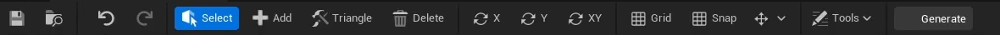

# Manual Sprite Editor Tools для Unreal Engine

**Manual Sprite Editor Tools** — это комплексный плагин для Unreal Engine, предоставляющий специализированный редактор для создания и управления пользовательской 2D-геометрией для ассетов `PaperSprite`. Это незаменимый инструмент для разработчиков, которым нужен точный контроль над мешами спрайтов, особенно для генерации оптимизированных ассетов `StaticMesh` и `SkeletalMesh` из 2D-графики.

Этот плагин был создан, чтобы заполнить критический пробел в стандартном рабочем процессе Paper2D, предлагая функции, необходимые для продвинутой разработки 2D-игр.

](https://youtu.be/MbnoJhVYDTc)
*Демонстрация процесса редактирования геометрии и генерации меша.*

---

## Оглавление

- [О проекте](#о-проекте)
- [Ключевые возможности](#ключевые-возможности)
- [Установка](#установка)
- [Как использовать](#как-использовать)
  - [Шаг 1: Создайте ассет Manual Sprite](#шаг-1-создайте-ассет-manual-sprite)
  - [Шаг 2: Откройте редактор](#шаг-2-откройте-редактор)
  - [Шаг 3: Отредактируйте геометрию](#шаг-3-отредактируйте-геометрию)
  - [Шаг 4: Сгенерируйте меш](#шаг-4-сгенерируйте-меш)
- [Интерфейс редактора](#интерфейс-редактора)
  - [Тулбар (Панель инструментов)](#тулбар-панель-инструментов)
  - [Горячие клавиши](#горячие-клавиши)
- [Настройки проекта](#настройки-проекта)
- [Контакты](#контакты)

## О проекте

Стандартный рабочий процесс Unreal Engine для 2D-спрайтов хорош для простых случаев, но ему не хватает точности и гибкости, необходимых для сложных персонажей или объектов. Этот плагин представляет новый ассет, `Manual Sprite`, и специальный редактор, чтобы дать разработчикам полный контроль над геометрией, позволяя:
-   Создавать **идеальные попиксельные коллизии.**
-   **Оптимизировать сложность меша**, вручную расставляя вершины и треугольники.
-   **Генерировать 3D-меши (`StaticMesh` и `SkeletalMesh`)** прямо из 2D-геометрии, в комплекте с материалами и базовым скелетом.

## Ключевые возможности

-   ✅ **Специализированный редактор ассетов:** Профессиональный, отдельный редактор для ассетов `Manual Sprite` с вьюпортом, панелью деталей и многофункциональным тулбаром.
-   ✅ **Полный контроль над геометрией:** Вручную добавляйте, удаляйте и перемещайте вершины. Создавайте треугольники, выбирая любые три вершины.
-   ✅ **Продвинутые инструменты редактирования:**
    -   **Полная поддержка Undo/Redo** для всех операций с геометрией.
    -   Функции **Копировать, Вставить, Вырезать и Дублировать** для вершин.
    -   **Зеркальное редактирование** по осям X, Y или обеим сразу для ускорения работы с симметричными объектами.
    -   **Сетка и привязка к сетке** для точного размещения вершин.
-   ✅ **Генерация мешей:**
    -   Генерируйте ассеты **`StaticMesh`** или **`SkeletalMesh`** в один клик (`Ctrl+M`).
    -   Полный контроль над **расположением пивота (Pivot Point)** (Центр, Низ, Начало координат или Пользовательский).
    -   Автоматическое создание материалов (Lit/Unlit, двусторонние).
-   ✅ **Интеллектуальная триангуляция:**
    -   **Автоматическая триангуляция Делоне** для выделенных вершин (клавиша `3`).
    -   **Проверка на пересечения**, которая подсвечивает пересекающиеся ребра красным, обеспечивая чистую геометрию.
-   ✅ **Полная интеграция с редактором:** Создавайте ассеты `Manual Sprite` прямо из Content Browser.

## Установка

1.  Скопируйте папку `ManualSpriteEditorTools` в директорию `Plugins` вашего проекта. (Если папки `Plugins` нет, создайте ее в корневой папке проекта).
2.  Перезапустите редактор Unreal Engine.
3.  Движок предложит скомпилировать плагин, если это необходимо. Согласитесь и дождитесь завершения.
4.  Плагин готов к использованию!

## Как использовать

### Шаг 1: Создайте ассет Manual Sprite

В **Content Browser** нажмите правую кнопку мыши и в категории **Paper2D** выберите **Manual Sprite**. Дайте имя вашему новому ассету.

### Шаг 2: Откройте редактор

Дважды щелкните по вашему новому ассету `Manual Sprite`, чтобы открыть специализированный редактор. В панели **Details** назначьте **Source Texture** и убедитесь, что галочка **Use Manual Geometry** включена.

### Шаг 3: Отредактируйте геометрию

Используйте кнопки на тулбаре или горячие клавиши для формирования вашего меша.

-   **Режим выделения (Q):** Нажмите и перетаскивайте, чтобы перемещать вершины. Перетаскивайте на пустом месте, чтобы создать рамку выделения.
-   **Режим добавления вершин (W):** Нажмите в любом месте вьюпорта, чтобы добавить новую вершину.
-   **Режим треугольников (E):** Выберите любые три вершины, чтобы создать треугольник. Выделение очистится автоматически.
-   **Режим удаления (R):** Нажмите на вершину или треугольник, чтобы удалить его.

### Шаг 4: Сгенерируйте меш

Когда ваша геометрия будет готова, нажмите `Ctrl+M` или кнопку **Generate** на тулбаре. Откроется диалоговое окно **Mesh Generation**.

<!-- ЗАМЕНИТЕ ЭТО НА СКРИНШОТ ОКНА ГЕНЕРАЦИИ МЕША -->

Здесь вы можете настроить результат:
-   **Mesh Type:** Выберите между `StaticMesh` и `SkeletalMesh`.
-   **Pivot Placement:** Определите, где будет находиться точка опоры (пивот) объекта.
-   **Asset Name & Path:** Укажите имя и местоположение для новых ассетов.
-   **Material Settings:** Автоматически создайте Lit или Unlit материал для меша.

Нажмите **Generate**, и новые ассеты будут созданы и подсвечены в Content Browser!

## Интерфейс редактора

### Тулбар (Панель инструментов)

Тулбар предоставляет быстрый доступ ко всем основным функциям:

| Группа                 | Кнопки                                        | Описание                                          |
| :--------------------- | :-------------------------------------------- | :------------------------------------------------ |
| **История**            | Undo, Redo                                    | Стандартные функции отмены/повтора действий.      |
| **Режимы**             | Select, Add, Triangle, Delete                 | Переключение между режимами редактирования.       |
| **Зеркалирование**     | X, Y, XY                                      | Включение зеркального редактирования по осям.     |
| **Сетка**              | Grid, Snap, Size                              | Управление видимостью, привязкой и размером сетки.|
| **Инструменты**        | (Выпадающее меню)                             | Доступ к копированию, выделению и утилитам.       |
| **Генерация**          | Generate                                      | Открывает диалог генерации меша.                  |

### Горячие клавиши

| Клавиша          | Действие                                                       |
| :--------------- | :------------------------------------------------------------- |
| **Q, W, E, R**   | Переключить режим редактирования                               |
| **X, Y, Shift+X**| Включить зеркалирование                                        |
| **G, Ctrl+G**    | Включить сетку / привязку к сетке                              |
| **3**            | Авто-триангуляция выделенных вершин                            |
| **4**            | Удалить все треугольники, связанные с выделенными вершинами    |
| **V**            | Проверить триангуляцию на пересечения                          |
| **Ctrl+Z / Ctrl+Y** | Отменить / Повторить действие                                 |
| **Ctrl+C / Ctrl+V** | Копировать / Вставить вершины                                 |
| **Ctrl+M**       | Открыть диалог генерации меша                                  |
| **Delete**       | Удалить выделенные вершины/треугольники                        |
| **Колесо мыши**  | Приблизить / Отдалить                                          |
| **Средняя кнопка**| Перемещать вид                                                 |

## Настройки проекта

Вы можете настроить параметры генерации мешей по умолчанию в **Edit -> Project Settings -> Plugins -> Manual Sprite Mesh Generator**.

## Контакты

Ссылка на проект: [https://boosty.to/channel-jonathan-developer](https://boosty.to/channel-jonathan-developer)
